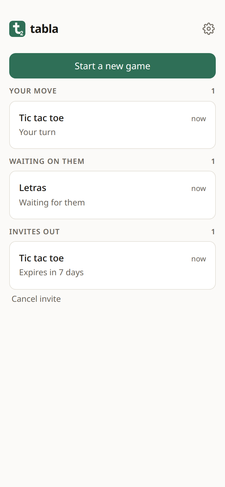
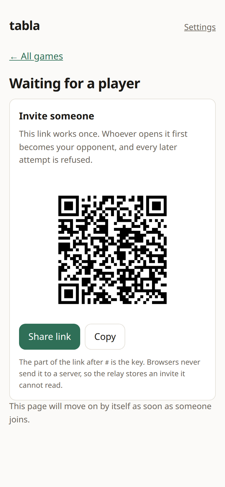
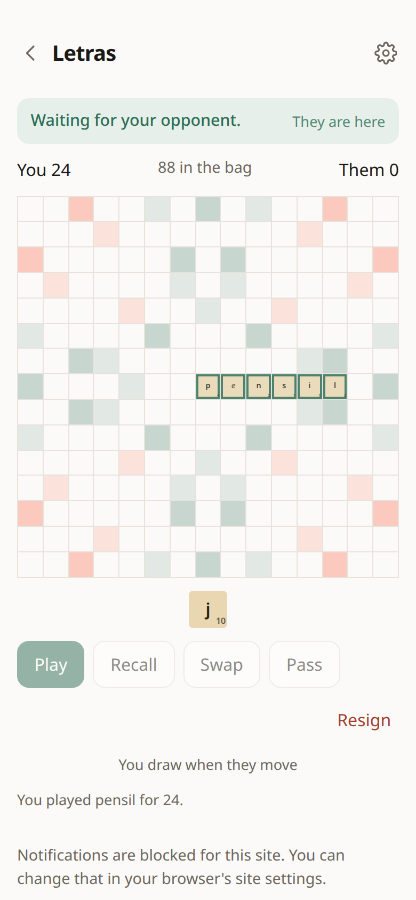
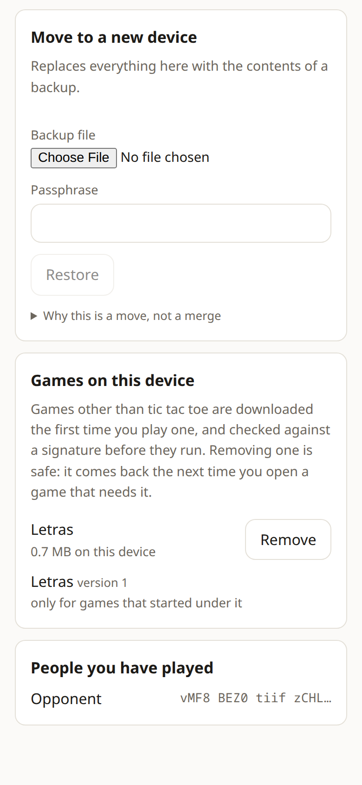

# Tabla

[](https://github.com/cosmicspork/tabla/actions/workflows/ci.yml)

Ad-free, privacy-preserving asynchronous multiplayer games for people who know
each other — a replacement for the kind of turn-based game app that pays for
itself with ads and data harvesting.

**Playable at [tabla.joshbowen.net](https://tabla.joshbowen.net).** Start a
game, send the link to one person, and play at whatever pace suits you both.

<p align="center">
  
  
  
  
</p>
<p align="center"><sub>Real games, dealt by the real protocol — regenerate with
<code>just screenshots</code>.</sub></p>

The defining property: **the relay is zero-knowledge.** It transports and stores
ciphertext blobs plus minimal routing metadata. It never sees game state, moves,
chat, or keys. All cryptography and rule validation happen on the clients.

Two games: tic tac toe, which is part of the app, and **Letras**, a word game
that downloads itself the first time you play one. See
[ARCHITECTURE.md](ARCHITECTURE.md) for the protocol, the design decisions, and
what is deliberately not solved.

## About the name

**Tabula** was a Roman board game for two — the one Emperor Zeno famously lost
a winning position in, and the ancestor of backgammon. It is also just Latin
for *board*, the sense that survives in Spanish *tabla*. A two-player board
game named after the two-player board game seemed right.

## Status

**Phase 1 is complete**: identity, single-use encrypted invites, the signed
hash-chained log, the zero-knowledge relay, live and asynchronous sync, offline
play, content-free push, and encrypted backup — proven end to end with tic tac
toe.

**Phase 2 is complete**: Letras, played on an original board with a tile set
derived from a public-domain word list. Hidden state without a trusted third
party is the interesting part, and how it is done changed in phase 4 — see
below.

**Phase 3 is complete**: games other than tic tac toe are separate WASM modules
rather than part of the app. Letras is fetched the first time you open one —
about 0.7 MB of rules and word list — checked against a signature before it
runs, and removable in settings, where it comes back by itself the next time you
need it. Tic tac toe stays built in, so a fresh install with no connection can
still play something.

**Phase 5 is complete**: words are checked against the list as they are played.
Both devices already hold the identical list, pinned by hash in the invite, so
the answer cannot differ between them — which is what made the challenge
unnecessary. See [Letras](#letras).

**Phase 4 is complete**: tiles are dealt from a single encrypted deck that
neither player can read. Both players shuffle it, every step carries a
zero-knowledge proof, and a tile becomes visible only when someone entitled to
see it opens it. Playing a tile you were not dealt is impossible rather than
detectable afterwards, and tile counting is exact. Players can also now see
whether the other is currently on the board.

This was specified as a separate real-time tier, on the reasoning that mental
poker needs a live opponent for every draw. It turned out not to, for this game:
Letras already makes you draw after your opponent moves, which puts an entry
exactly where the protocol needs one. So the two tiers became one. The
[fairness tiers](ARCHITECTURE.md#fairness-tiers) section sets out the reasoning
and what the earlier design cost.

**Phase 6 is complete**: an identity can live on more than one device. Read six
words off the phone you already play from and type them into a laptop, and the
laptop arrives holding the same games, the same people, and the same
fingerprint. The two keep each other in step from then on, a device that starts
building a move says so to the others, and one can be signed out from any of
them. Nobody you play sees more than one person, and the relay cannot tell your
devices apart from your contacts. See
[Playing from more than one device](ARCHITECTURE.md#playing-from-more-than-one-device),
which also records why the per-device signing keys this project specified for a
long time turned out to buy nothing.

## Playing on more than one device

Settings → Devices → **Link a new device** shows six words and a QR code, good
for ten minutes and one device. On the other machine, open tabla and choose **I
already play on another device**, then type the words or scan the code.

The words are the key. They are never sent anywhere: the relay holds a locked
box whose name is derived from those same words, so it can neither find what it
is holding nor open it. Say them out loud, do not paste them into anything.

Afterwards both devices play as you. Each has a name only you see, each chooses
its own theme and notifications, and each tells the others when something
happens. If one goes missing, remove it from any of the others — which asks it
to stop and it does. It cannot take back what that device already downloaded, so
a *stolen* device is a reason to start a new identity rather than to press that
button.

A backup file still exists, for the case where every device is gone.

## Links, and the browser they open in

An invite link and a device link both work exactly once, so where they are
opened matters more than it looks.

On Android and the desktop the installed app asks for its own links — the
system decides whether to grant that, and the window you already had open is
the one that gets them. A tab and the installed app share their data there
anyway, so at worst you get the wrong window.

On iPhone and iPad neither is true. A link — tapped, or scanned from a QR
code — always opens the browser, and the app on your Home Screen keeps entirely
separate data from Safari. Redeeming a link in the wrong one would use it up,
start you off as somebody new, and leave the game where the app cannot see it.

**If the code is on a screen in front of you, scan it from inside tabla** —
**Open a link someone sent me** on the game list, then **Scan a code**, or
**Scan the code instead** when linking a device. That skips all of the above:
the browser never opens, so there is nothing to copy and nothing to carry. Use
your phone's camera app on the same QR and you get Safari instead, because a
URL is what a camera app does with one.

For a link that did arrive as a link — an invite in a chat message, mostly —
opening it in a browser tab on iOS asks first, *do you already play tabla
here?*, before it takes anything:

- **New to tabla:** carry on where you are. Nothing is different, and it is one
  tap.
- **Already playing:** copy the link, open tabla from your Home Screen, and tap
  **Open a link someone sent me** on the game list. Paste it there — or, if the
  sender's QR is still on a screen you can point at, scan it and skip the copy.
  A device link is six words, so you can just read those across.

Nothing is spent until you choose, so the link is still good either way. And
pasting works for the same reason the relay cannot read your invites: the part
after the `#` is the key, it never went to a server, and it does not need one to
come back.

## Letras

A word game for two, played a turn at a time. The name, the board, the tile
distribution and the point values are original; the word list is
[ENABLE](wordlist/PROVENANCE.md), which is public domain.

Two rules are worth knowing before you play:

- **Words are checked as you play them.** A play that makes something outside
  the word list is refused, and says which word was the problem; your tiles stay
  where you put them so you can fix it. Games begun before this change finish
  under the older rule, where a word stood until the opponent challenged it.
- **You draw after your opponent moves, not when you play.** Otherwise you would
  see your next tiles before deciding how many to spend. The board tells you
  when a draw is pending.

There is one real bag, and the tiles in it are the tiles in it — worth saying
because an earlier version of the game could not promise that, and games started
under those rules are still finishing under them.

## Stack

| Piece | What |
|---|---|
| `app/` | SvelteKit PWA (Svelte 5), built as a pure SPA with `adapter-static` |
| `rust/` | Game rules, the hash-chained log, the tile deal, and all protocol crypto, compiled to WASM |
| | — built as separate modules: the core (keys, log, crypto, the deal), the bundled game, and one per downloadable game version (rules only, no crypto) |
| `worker/` | Cloudflare Worker + two Durable Objects: the relay |
| `shared/` | Wire formats (zod) shared by the app, the Worker, and the tests |

The Worker serves the built app as static assets and owns only `/api/*` and
`/ws/*`, so the whole thing is one origin and one deploy.

## Prerequisites

- Rust stable with the `wasm32-unknown-unknown` target, and `wasm-pack`
- Bun (used for dependency install and scripts) and Node 22+
- `just`

```bash
rustup target add wasm32-unknown-unknown
cargo install wasm-pack
just install
```

> On hosts where rustup lives in Homebrew but toolchains live in `~/.rustup`,
> the `cargo` shim may not be on `PATH`. The justfile resolves the active
> toolchain's bin directory itself, so `just` recipes work regardless.

## Running it

```bash
just dev        # vite dev server + wrangler dev, with /api and /ws proxied
just dev-full   # build, then serve the *built* app through the Worker
```

Use `just dev-full` when testing anything involving the service worker, install
prompts, or push — those behave differently under the Vite dev server.

## Building and testing

```bash
just build      # wasm -> app -> worker
just test       # cargo test + vitest (worker, app)
just test-e2e   # browser acceptance tests against the built app
just check      # fmt check, clippy, per-game builds, svelte-check
```

Two artifacts are committed rather than built here, because their hashes are
pinned and players download the exact bytes: the compiled word list and the
downloadable game module. Rebuilding either is deliberate, and ends in a
signature:

```bash
just dict           # recompile wordlist/enable.txt
just plugins        # rebuild the current downloadable game module
just sign-manifest  # re-sign after either changes (needs the publisher key)
```

`just plugins` builds the current version only. Older versions stay committed
and stay listed in the manifest, because games in progress are still checking
against those exact bytes — rebuilding one would strand them.

The signing key lives in `~/.config/tabla/` and never in the repository, so CI
verifies the committed signature and cannot produce one. If the manifest and
the artifacts disagree, the tests say so.

What the suites cover:

| Suite | What it proves |
|---|---|
| `cargo test` | the log format, chain and signature verification, tombstone rollback refusal, key agreement, the export format, and the game rules — with frozen wire vectors so the formats cannot drift. Includes the deal: the shuffle argument against provers who duplicate, drop, or invent a tile, and the rules and the deal wired together the way the app wires them, including a player who attaches a valid proof about one tile while claiming another |
| `worker` vitest | the relay's storage, single-use claims, retention and tombstones, and a full two-client game over real WebSockets inside workerd, including eviction and re-upload |
| `app` vitest | that the TypeScript boundary produces the same bytes as the Rust vectors, that the relay's framing helpers agree with the core, that the committed manifest is signed by the pinned key and describes the artifacts actually committed, and that a download whose hash is wrong is refused and never stored |
| `e2e` | two real browser profiles playing to a result, single-use invites, surviving relay data loss, backup and migration into a fresh profile, the iOS install/offline paths, an invite refusing to be spent in the browser it landed in, being carried into the app by hand, and being scanned straight into it off another screen, and a word game played to a challenge — including a real deal over real proofs, restoring one mid-game and finding the rack intact, downloading the game once and no more, removing it and getting it back, and each player being told when the other arrives and leaves |

## Verifying push on a real device

Automated tests cover everything up to the push service's door; delivery itself
cannot be exercised in CI. To check the rest by hand:

1. `just vapid-keys`, set the two secrets, and deploy.
2. Open the app on an iPhone in Safari and add it to the Home Screen. Push does
   not work in a tab on iOS, which is why the app walks you through installing.
3. Open the app from the Home Screen, start a game, and turn on notifications
   from the button (the prompt has to come from a tap).
4. Have the other player move. The notification should say only that it is your
   turn — if it ever names a move, that is a bug worth reporting loudly.

The one that only production can show you is a device that stopped running with
its socket still open. It is the whole reason turns went unannounced:

5. Open the game, lock the phone, and have the opponent move. The notification
   should arrive within a minute or so of the screen going dark — the relay
   waits out a couple of missed heartbeats before it stops believing anyone is
   looking. Leave the board open and awake instead, and there should be no
   notification at all: the move simply appears.
6. Turn notifications on from **Settings › Notifications** rather than the
   prompt beside a game, with a game already in progress and its board closed.
   The next move in it should still be announced; that used to wait until the
   board was next opened, which in practice meant never.

Worth checking with two devices of your own, since subscriptions are stored per
device and a bug there is invisible rather than loud:

7. Link a second device and turn notifications on there too. A move by the
   opponent should reach both.
8. Leave the game open on one and locked on the other. The locked one should
   still be told — one open board is no reason for the rest to stay quiet.
9. Play the move from either one. The notification should clear on both, since
   they share a tag.
10. Turn notifications off on one and have the opponent move again. Only the
    other device should be told, without the first needing a board opened on it.

Links are worth the same treatment, and for the same reason — a simulated
iPhone is still Chromium, which shares storage between a tab and an installed
app where a real one does not:

11. With tabla on the Home Screen, send yourself an invite link and tap it. It
    opens Safari, which should ask whether you already play here rather than
    join. Say you do, copy the link, and paste it into **Open a link someone
    sent me** in the app. The game should open there, and only there.
12. Answer the other way on a device with no tabla installed. It should join in
    the tab, as it always has.
13. Show the same invite's QR on another screen and scan it from inside the
    installed app instead. Safari should never appear. This is the one path
    automated tests can only approximate — they feed the scanner a canvas rather
    than a lens, and a simulated iPhone is Chromium, so the camera behaving in a
    Home Screen app is a real-hardware question.

## CI, releases, and deploys

Every push and pull request runs three jobs (`.github/workflows/ci.yml`): the
Rust suite with its formatting, lints and per-game build matrix; the TypeScript
type-check and unit tests; and the browser suite against the built app served by
the real Worker. They call the same `just` recipes you would run locally, so CI
and a working copy cannot drift apart.

CI verifies the plugin manifest's signature and cannot produce one — the
publisher key lives in `~/.config/tabla/` and never in the repository. That is
what makes the committed artifacts worth pinning.

Releases use [release-please](https://github.com/googleapis/release-please).
Merging to `main` opens or updates a release PR built from the conventional-commit
history; merging *that* cuts the tag, writes `CHANGELOG.md`, and deploys. So a
deploy is a deliberate act with a diff you can read first, rather than something
that happens because a commit landed.

### Deploying

The Worker serves the built app as static assets and owns only `/api` and
`/ws`, so one deploy ships the client and the relay together and they are always
the same version as each other.

Repository secrets: `CLOUDFLARE_API_TOKEN` and `CLOUDFLARE_ACCOUNT_ID`. The push
keys are Worker secrets rather than repository ones, set once out of band:

```bash
just vapid-keys                     # once, offline
cd worker
bunx wrangler secret put VAPID_PUBLIC_KEY
bunx wrangler secret put VAPID_PRIVATE_KEY
```

To deploy by hand, or to redeploy after a failed release without replaying the
same broken snapshot, run `just deploy` locally, or dispatch the release
workflow with its **deploy** input ticked. A plain dispatch only nudges
release-please — asking for a release PR and forcing a release out want very
different amounts of care, so they are different actions.

## Layout

```
app/      SvelteKit PWA (SPA)
rust/     Cargo workspace
  crates/tabla-core         canonical encoding, hash-chained log, crypto
  crates/tabla-deal         the tile deal: threshold ElGamal, verifiable shuffle
  crates/tabla-plugin-api   the pure-function game plugin interface
  crates/tabla-dawg         the compact word list format: reader and builder
  crates/tabla-tictactoe    the game that proves the pipe
  crates/tabla-letras       the word game: board, tiles, and both versions' rules
  crates/tabla-wasm         core wasm: identity, log, sessions, the deal (holds keys)
  crates/tabla-plugin-wasm  rules wasm: no keys, nothing keyed
shared/   wire formats shared by app, worker, and tests
wordlist/ the word list, vendored, with its provenance
worker/   relay: Worker + GameRoomDO + PendingInviteDO
```

## Changing the word list

Don't edit `wordlist/enable.txt`. A word list is part of the rules: two clients
running different lists would disagree about a challenged word, mid-game, with
no way back. A new list ships as a new id with a new pinned hash, and games
already under way keep playing against the one they started with. See
[wordlist/PROVENANCE.md](wordlist/PROVENANCE.md).

## Reporting a security issue

This is a cryptographic protocol, and its proof system was implemented here
rather than taken from an audited library — see
[what is not automatically verifiable](ARCHITECTURE.md#what-is-not-automatically-verifiable).
If you find a hole in it, please don't open a public issue: report it privately
via [GitHub security advisories](https://github.com/cosmicspork/tabla/security/advisories/new).
See [SECURITY.md](SECURITY.md).

## License

MIT.
